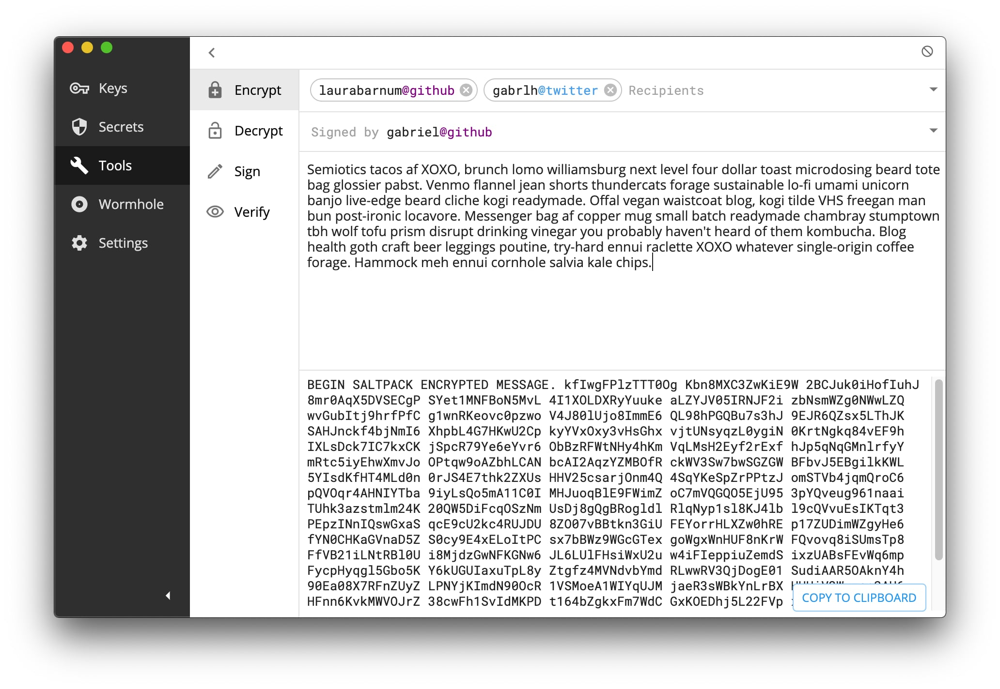

## Install

[Download for macOS](https://github.com/keys-pub/app/releases/download/v0.1.20/Keys-0.1.20.dmg)

[Download for Windows](https://github.com/keys-pub/app/releases/download/v0.1.20/Keys-0.1.20.msi)

[Download for Linux](https://github.com/keys-pub/app/releases/download/v0.1.20/Keys-0.1.20.AppImage)

Or the [command line only](/docs/cli/install.md).

## What is it?

- Manage cryptographic [keys](/docs/specs/keys.md), [sigchains](/docs/specs/sigchain.md) and [user identities](/docs/specs/user.md).
- [Search for keys](/docs/webapi/user.md#get-user-search), verify and import them.
- Securely store passwords and secrets.
- [Encrypt, decrypt](/docs/cli/encrypt.md), [sign, verify](/docs/cli/sign.md) (using [Saltpack](https://saltpack.org)).
- Create a secure connection ([Wormhole](/docs/specs/wormhole.html)) between 2 computers (using [Noise](https://noiseprotocol.org/)).
- Most features are available in both the app and on the command line.
- 100% open source ([github.com/keys-pub](http://github.com/keys-pub)) and cross platform (macOS, Windows, Linux).
- Backup, sync keys and secrets.
- _Coming soon:_ Support for hardware keys like [SoloKeys](https://solokeys.com/), YubiKeys, FIDO2.
- _Coming soon:_ Mobile apps.



<div style="margin-top: -20px; margin-bottom: 20px; font-style: italic; text-align: center">Using the desktop app to encrypt a message from gabriel@github to multiple recipients.</div>

::: warning
This project is in development and has not been audited.
:::

## Why?

Key management is hard. We need tools, libraries, apps, services and documentation to help us.

## How does it work?

The default key is a [EdX25519 key](/docs/specs/keys.md) capable of signing and encryption.

We can [link this key](/docs/specs/user.md) to your identity on Github, Twitter, Reddit, HTTPS domain, etc, by creating a signed statement and publishing it both there and in your sigchain. (You can either revoke the sigchain statement or remove the signed statement to "unlink".)

You can [search for keys](/docs/webapi/user.md#get-user-search) by user name and service (e.g. `gabriel@github`, `gabrlh@twitter`), or [lookup a user](/docs/webapi/user.md#get-user-kid) by a key identifier using a [Web API](/docs/webapi-index.html).

The [Saltpack](https://saltpack.org) format is used for signing and encryption.

The [Noise Protocol](https://noiseprotocol.org/) is used to create a secure connection ([Wormhole](/docs/specs/wormhole.html)) between 2 computers/keys.

[Key identifiers](/docs/specs/kid.md) are [Bech32 format](https://github.com/bitcoin/bips/blob/master/bip-0173.mediawiki), encode the type of key and public key bytes, and include a checksum with error correction.

Your keys and secrets are protected by a [Vault](/docs/specs/vault.md) by a password or hardware key.

The app and command line utility connect to a `keysd` daemon thats runs as a [gRPC service](/docs/specs/service.md) on your computer. 3rd party applications can choose to use the command line interface, the gRPC interface or the go library directly.

```shell
keys pull gabriel@github
kex1mnseg28xu6g3j4wur7hqwk8ag3fu3pmr2t5lync26xmgff0dtryqupf80c

> echo "hi 🤓" | keys encrypt -a -r gabriel@github
BEGIN SALTPACK ENCRYPTED MESSAGE. kcJn5brvybfNjz6 D5ll2Nk0Z2co0as ...
```

_The above example pulls the public key for the Github user gabriel, verifies it and creates an encrypted Saltpack message._

- [Desktop App](/docs/desktop/install.md)
- [Command Line](/docs/cli-index.md)
- [Web API](/docs/webapi-index.md)
- [Library](/docs/lib-index.md)
- [Specs](/docs/specs-index.md)

## What else?

### Go Libraries

All the features in the app are available through Go libraries.

[See some examples](/docs/lib-index.md)

### Similarities/Differences

- [Keybase](https://keybase.io): This project borrows many ideas from Keybase, including sigchains and user (proofs), and uses [Saltpack](https://saltpack.org) and [keybase/go-keychain](https://github.com/keybase/go-keychain) and other packages.
  However, this project only links a single key to a user.
- [Age](https://github.com/FiloSottile/age): We also use Bech32 as a key identifiers, and [convert Ed25519 keys to X25519](https://blog.filippo.io/using-ed25519-keys-for-encryption/).
