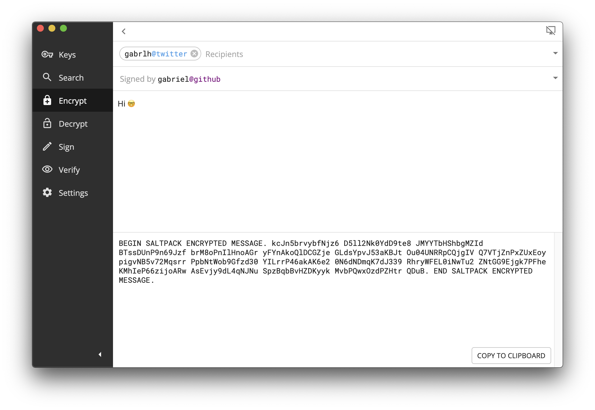

::: warning
This project is in development and has not been audited. Don't use for anything important yet.
:::

## Install

[Download for macOS](https://github.com/keys-pub/app/releases/download/v0.0.27/Keys-0.0.27.dmg)

[Download for Windows](https://github.com/keys-pub/app/releases/download/v0.0.27/Keys-0.0.27.msi)

Or the [command line only](/docs/cli/install.md).

## Introduction

Key management is hard.

keys.pub is an app that manages cryptographic keys, sigchains and user identities. It integrates with other frameworks to provide signing and encryption, such as [Saltpack](https://saltpack.org) or [Noise Protocol](https://noiseprotocol.org/).

```shell
> keys pull gabriel@github
kex1mnseg28xu6g3j4wur7hqwk8ag3fu3pmr2t5lync26xmgff0dtryqupf80c

> echo "hi 🤓" | keys encrypt -recipient gabriel@github -armor -stdin -stdout
BEGIN SALTPACK ENCRYPTED MESSAGE. kcJn5brvybfNjz6 D5ll2Nk0Z2co0as ...
```

_The above example pulls the public key for the Github user gabriel, verifies it and creates an encrypted message._

The default key is a [Ed25519/X25519 key](/docs/specs/keys.md) capable of signing and encryption.
This key can also be used to create a [sigchain](/docs/specs/sigchain.md) (an ordered sequence of signed statements).
You can [link a key to an identity](/docs/specs/user.md) (on Github, Twitter, Reddit, etc), by publishing a signed statement to this sigchain.

The [Saltpack](https://saltpack.org) format is used for signing and encryption, providing authenticity, repudability and anonymity.

You can [search for keys](/docs/restapi/user.md#get-user-search) by user name and service, or [lookup a user](/docs/restapi/user.md#get-user-kid) by a key identifier using a [REST API](/docs/restapi/).

[Key identifiers](/docs/specs/kid.md) are [Bech32 format](https://github.com/bitcoin/bips/blob/master/bip-0173.mediawiki), encode the type of key and public key bytes, and include a checksum with error correction.

Your keys are protected by a [keyring](/docs/specs/keyring.md) which is secured by both the OS and a user supplied password (similar to a password manager).

The `keysd` daemon runs as a [gRPC service](/docs/specs/service.md) on your computer.

- [Desktop App](/docs/desktop/install.md)
- [Command Line](/docs/cli-index.md)
- [REST API](/docs/restapi-index.md)
- [Library](/docs/lib-index.md)
- [Specs](/docs/specs-index.md)



_Using the desktop app to encrypt a message for the Github user gabriel._

### Similarities/Differences

- [Keybase](https://keybase.io): This project borrows many ideas from Keybase, including sigchains and user (proofs), and uses [Saltpack](https://saltpack.org) and [keybase/go-keychain](https://github.com/keybase/go-keychain) and other packages.
  However, this project only links a single key to a user.
- [Age](https://github.com/FiloSottile/age): We also use Bech32 as a key identifiers, and [convert Ed25519 keys to X25519](https://blog.filippo.io/using-ed25519-keys-for-encryption/).

### Coming soon

- Other key types like age?
- Legacy/pgp?
- Better documentation
- More services (Facebook, Website)
- Inbox
- Import SSH ed25519 keys
- Wormhole through relays (syncthing)
- Syncthing integration
